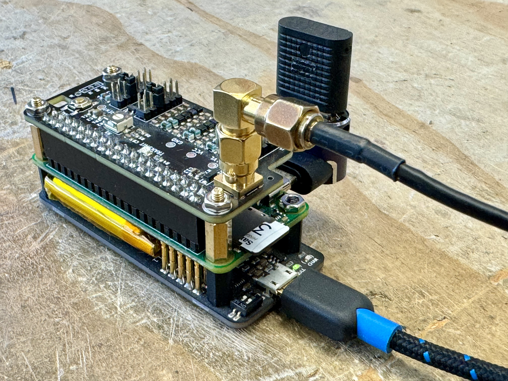
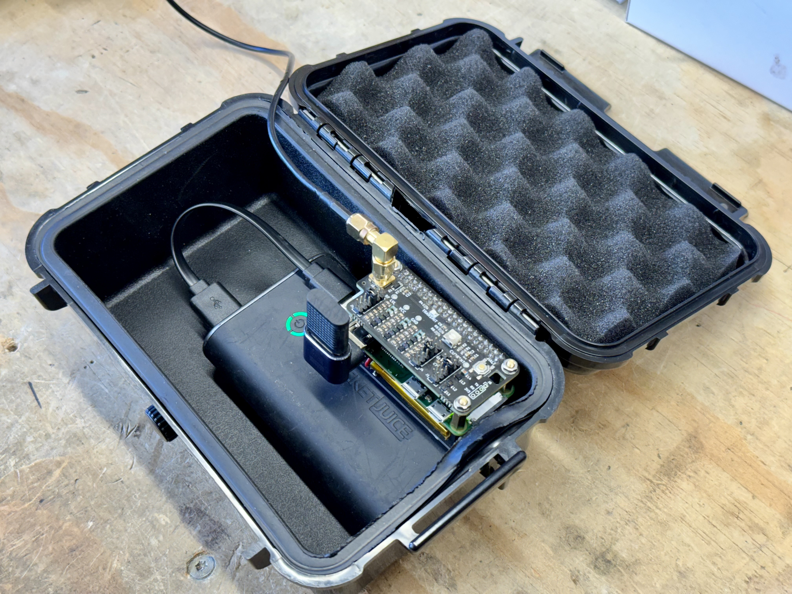
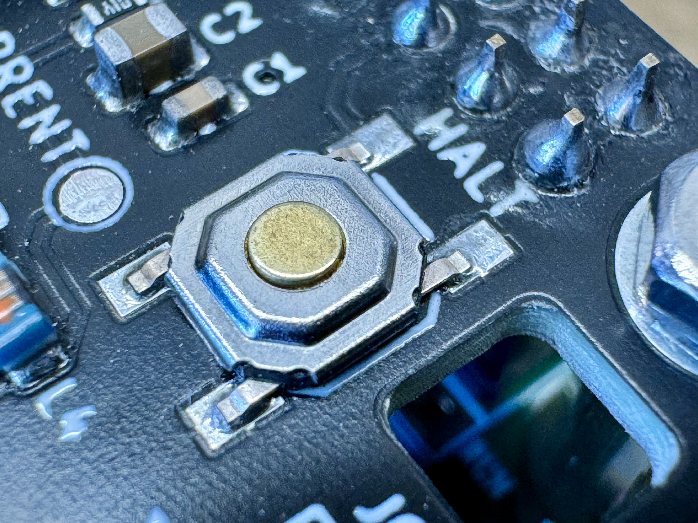
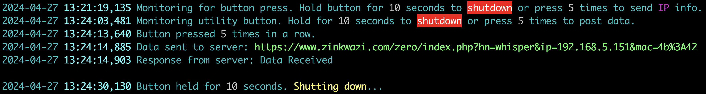

# WSPR-zero Project

The WSPR-zero project, developed by Greg Lawler, brings together various community contributions into an easy-to-install package tailored for the Raspberry Pi Zero, although it is also tested on the Raspberry Pi 4. This project aims to provide a small footprint, cost-effective, and ultra-portable solution for transmitting WSPR signals.

## About WSPR-zero

WSPR (pronounced "whisper") stands for Weak Signal Propagation Reporter. The WSPR-zero project allows radio enthusiasts to send low-power signals around the globe for testing radio wave propagation by bouncing off the ionosphere. This project is ideal for field use, such as backpacking and traveling, due to its compact size and low power requirements.

### Features

- **Compatibility**: Primarily developed for the Pi Zero but also works on Pi 3 & 4.
- **Cost-Effective**: The total cost of the setup ranges from $40 - $80, depending on the antenna used.
- **WSPR-zero Filter Hat**: Developed by Outside Open, based on a filter by TAPR (tapr.org), but redesigned to comply with standard Raspberry Pi HAT specifications. This board helps filter out the noisy RF generated by the Pi.
- **Transmission Modes**: Includes both transmit and receive modes.
  - **Transmit**: Requires a WSPR-zero or TAPR Reapberry Pi hat.
  - **Receive**: Requires an RTL-SDR USB device.
- **Extended Run Time**: Can easily run for over 24 hours on a portable phone battery pack.

### Required Hardware

- Raspberry Pi Zero, Pi 3 or Pi 4 (not yet tested on Pi 5)
- WSPR-zero or TAPR HAT (for transmission)
- HDMI dummy load dongle (for smoother operation on Pi Zero)
- RTL-SDR USB device (for receiving)
- Optional: UPS-Lite board for graceful shutdown when external and UPS-Lite batteries expire

## Installation

Ensure your Raspberry Pi is up to date and connected to the internet before starting the installation.
```
sudo apt update && sudo apt upgrade
sudo apt install rtl-sdr librtlsdr-dev libcurl4-openssl-dev libfftw3-dev
```
### SSH Configuration
If SSH access is painfully slow, run the following command on the Pi
**Add IPQoS to sshd_config**:
```
echo "IPQoS 0x00" | sudo tee -a /etc/ssh/sshd_config
```

## Contributing

Contributions to the WSPR-zero project are welcome! Please refer to the issues tab on GitHub to find tasks that need help or submit your suggestions and contributions via pull requests.

## License

This project is licensed under the MIT License - see the [LICENSE](LICENSE) file for details.

## Acknowledgments

Thanks to all contributors from the ham radio community, especially those who have provided testing feedback and code improvements.

## Support and Documentation

For more details, visit the [official GitHub repository](https://github.com/zinkwazi/wspr-zero).

## Images

### WSPR-zero Board Close-up

*Close-up view of the WSPR-zero assembly and components including WSPR-zero Hat, Raspberry Pi Zero 2 W and UPS-Lite.*

### WSPR-zero in Action

*Ready to hit the road.*

### WSPR-zero Utility Button

*Utility Button to gracefully shut down the Pi if held for 10 seconds or post internal IP info if pressed 5 times.*

### WSPR-zero Utility Button Log

*Utility Button log file showing the two use cases.*

### wsprnet.org 12 hour map for K6FTP

*Screenshot from wsprnet.org for traffic from WSPR-zero.*


**WSPR-zero Project © 2024 Greg Lawler.** All rights reserved. Visit our [GitHub repository](https://github.com/zinkwazi/wspr-zero) for more information.
