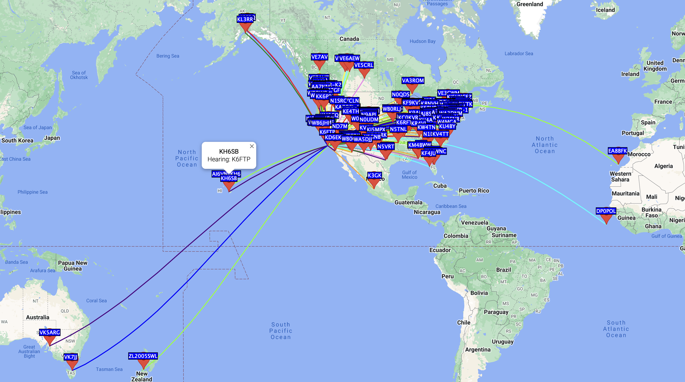
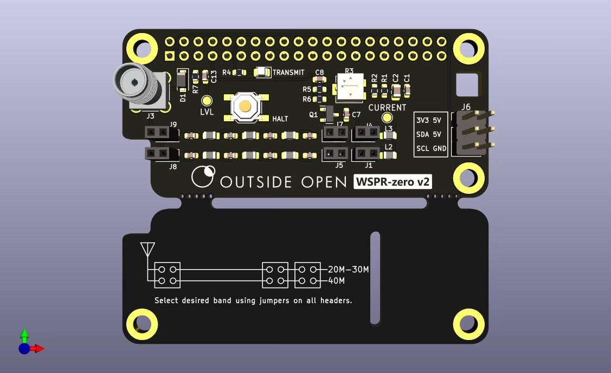

# WSPR-zero Project

The WSPR-zero project aims to provide a very small footprint, cost-effective, and ultra-portable solution for transmitting WSPR signals.
The project brings together various community contributions into an easy-to-install package tailored for the Raspberry Pi Zero, although it is also tested on the Raspberry Pi 3 & 4.

Enjoy!

-- Greg Lawler K6FTP

## About WSPR

**WSPR** (pronounced "whisper") stands for Weak Signal Propagation Reporter. 
The WSPR-zero project empowers radio enthusiasts (nerds?) to transmit low-power signals globally, testing radio wave propagation by bouncing off the ionosphere. Designed for portability and efficiency, this project is perfectly suited for outdoor activities such as backpacking and traveling, thanks to its compact size and minimal power requirements.

Adding to the fun, every WSPR transmission ever sent or received—is logged to a massive database and is available for download, providing a great dataset for budding data analysts!

WSPR-zero’s open-source nature allows users to dive into the Linux-based system, offering hands-on opportunities to tweak both the software and hardware. This level of accessibility not only enhances learning but also invites innovation and customization, making it a fun project for tech enthusiasts (nerds?) who love to tinker with technology.

Each WSPR transmission is 110.6 seconds long. This precise duration allows for a slow data rate that enhances the likelihood of reception under weak signal conditions. The remaining time within the two-minute interval (about 9.4 seconds) is used as a buffer to ensure that transmissions do not overlap and that there is time for transceivers to switch from transmit to receive mode, and vice versa.

**Crazy stat:** Each WSPR transmission contains just 40.5 bytes of data at the impressively low rate of 1.46 baud!

### Required Hardware

- Raspberry Pi Zero, Pi 3 or Pi 4 (not yet tested on Pi 5)
- WSPR-zero or TAPR.org HAT (for transmission)
- RTL-SDR USB device (for receiving)
- HDMI dummy load dongle (prevents crashing upon transmission on Raspberry Pi Zero)
- Antenna of some sort. Simple half dipole wire antenna is easy, cheap and works great!
- Optional: UPS-Lite board for graceful shutdown when external and UPS-Lite batteries expire

### Raspberry Pi Zero with WSPR-zero Hat

*Close-up view of a Raspberry Pi Zero 2 W, WSPR-zero Hat and UPS-Lite.*

### Features

- **Compatibility**: Primarily developed for the Pi Zero but also works on Pi 3 & 4.
- **Cost-Effective**: The total cost of the setup ranges from $40 - $80, depending on the antenna used.
- **WSPR-zero Filter Hat**: Developed by Outside Open, based on a filter by TAPR (tapr.org), but redesigned to comply with standard Raspberry Pi HAT specifications. This board helps filter out the noisy RF generated by the Pi.
- **Transmission Modes**: Includes both transmit and receive modes.
  - **Transmit**: Requires a WSPR-zero or TAPR Reapberry Pi hat.
  - **Receive**: Requires an RTL-SDR USB device.
- **Extended Run Time**: Can easily run for over 24 hours on a portable phone battery pack.

### Coming in V2
- **Real Time Clock Headers**
WSPR relies heavily on accurate time synchronization. Transmitters and receivers must have their clocks synchronized to Universal Time Coordinated (UTC) to within a second or so. This synchronization is critical because slight timing offsets can lead to missed transmissions or failure to decode signals properly.
- **Install Scripts**
Scripts to help newcomers get started with minimal effort.

## Installation
No install script yet - pull the repo and go from there :)

Ensure your Raspberry Pi is up to date and connected to the internet before starting the installation.
```
sudo apt update && sudo apt upgrade
sudo apt install rtl-sdr librtlsdr-dev libcurl4-openssl-dev libfftw3-dev
```
### SSH Configuration
If SSH access is painfully slow, run the following command on the Pi
**Add IPQoS to sshd_config**:
```
echo "IPQoS 0x00" | sudo tee -a /etc/ssh/sshd_config
```

## Contributing

Contributions to the WSPR-zero project are welcome! Please refer to the issues tab on GitHub to find tasks that need help or submit your suggestions and contributions via pull requests.

## Licensing

- This project is licensed under the MIT License - see the [LICENSE](LICENSE) file for details.
- All WSPR transmissions require the operator to be licensed by the FCC (or similar entitiy in other countries) in order to legally transmit.
- No license is required to use WSPR-zero as a WSPR receiver.

## Acknowledgments

Thanks to all contributors from the ham radio community, especially those who have provided testing feedback and code improvements.

## Support and Documentation

For more details, visit the [official GitHub repository](https://github.com/zinkwazi/wspr-zero).

## Images

### WSPR-zero in Action

*Ready to hit the road.*

### WSPR-zero Utility Button

*Utility Button to gracefully shut down the Pi if held for 10 seconds or post internal IP info if pressed 5 times.*

### WSPR-zero Utility Button Log

*Utility Button log file showing the two use cases.*

### wsprnet.org 12 hour map for K6FTP

*Screenshot from wsprnet.org for traffic from a WSPR-zero using a $4 half dipole 30m wire antenna draped on a hedge.*

### WSPR-zero v2 Board Render

*Render of v2 of the WSPR-zero Hat with RTC header - coming soon.**


**WSPR-zero Project © 2024 Greg Lawler.** All rights reserved. Visit our [GitHub repository](https://github.com/zinkwazi/wspr-zero) for more information.
